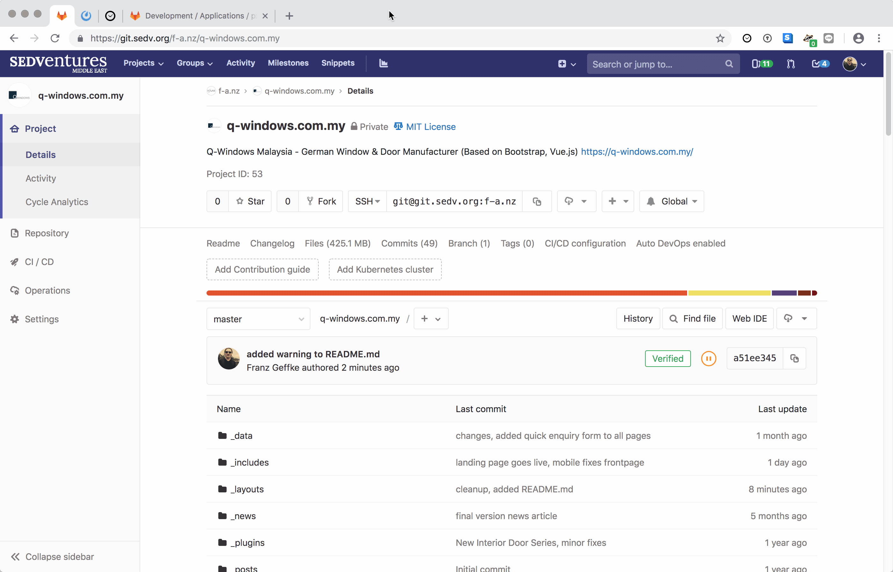

# German Windows Malaysia Website

This is the code-base of the German Windows website.

**CAUTION:** Any changes to the codebase are compiled and uploaded automatically. That means, they will go live on the website within max. 10 minutes.

## Promotions

### Edit existing

1. Open the folder `landing`
2. Open the file, ex. `booklet_soundproof.md`
3. Make changes and commit (will go live after max. 10 minutes)

_(There's a short clip here - it may take a moment to load. - 2MB)_

### Add new

1. Open the folder `landing`
2. Open an existing file, ex. `booklet_soundproof.md` and copy the content as template
3. Create a new file, ex. `booklet_doors.md` and paste the content
3. Make changes and commit (will go live after max. 10 minutes)

_(There's a short clip here - it may take a moment to load. - 3.2MB)_

## Requirements

To work on the German Windows website, you should fulfill the following requirements:

**Necessary**

- Expert on CSS3, HTML5
- Working knowledge of Javascript
- Experience with yarn, gulp or similar
- Markdown
- .git

**Good**

- Bootstrap 3
- Vue.js experience
- Working with Jekyll

## Development

**You can make changes directly in the browser**, using the built-in IDE, or download the code to your computer, to develop and test locally.

### 1) Download the code

    mkdir q-windows.com.my && cd q-windows.com.my
    git remote add origin https://git.sedv.org/f-a.nz/q-windows.com.my.git
    git pull origin master

### 2) Set-up your development environment

Before you get started, set-up the required tools, for development and asset compilation. Alternatively, a complete development environment is contained in Docker image `franzos/ruby-node-gulp-java`, which can be obtained trough the Docker Repository.

    bundle install
    yarn install

### 3) Development server and live asset compilation

Run the following two, in separate command line shells.

    gulp watch
    JEKYLL_ENV=development bundle exec jekyll serve -d public/